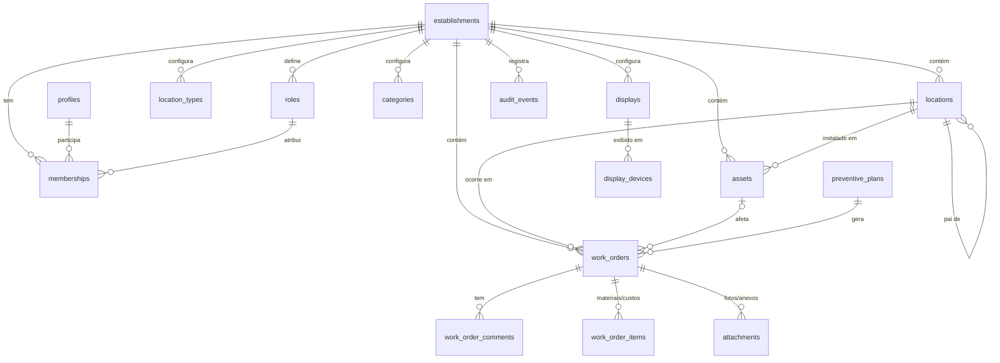

# ZMOLAK Maintenance — Análise, arquitetura e plano do MVP

> Nome interno e provisório: **ZMOLAK Maintenance**. Fica numa única constante (`src/config/brand.ts`) para ser trocado sem refatoração.
> Estado: **proposta para aprovação**. Nada foi implementado ainda.
> Data: 2026-10-09

---

## Etapa 1 — Análise

### 1.1 Identidade visual observada em zmolak.com

Fonte: site em produção (`/pt-BR`), CSS compilado e estilos computados no navegador.

| Elemento | O que existe hoje |
|---|---|
| **Logótipo** | Wordmark `ZMOLAK` em caixa alta, traço fino geométrico, com o **K estilizado** (haste aberta). Abaixo, `TECHNOLOGY` em versalete muito espaçado. Arquivo: `/brand/wordmark-transparent.webp` (244×46). Só em preto. |
| **Elemento gráfico** | Barras inclinadas (`/`, `//`, `///`) usadas como marcadores de secção e ícones. É o motivo visual mais reconhecível depois do logo. |
| **Paleta** | Estritamente **monocromática**. Tokens do site: `--paper #fff`, `--ink #000`, `--surface #f4f4f4`, `--line #d9d9d9`, `--muted #606060`, `--error #a52626`. Cinzas intermédios (`#303030`, `#737373`, `#aaa`, `#c8c8c8`). **Não há cor de destaque.** |
| **Tipografia** | **Manrope** (única família). Títulos com peso **550** e *tracking* negativo forte (−0,035em a −0,058em), *line-height* curto (~1,1). Texto e labels pequenos (0,68–0,9rem), peso 400/550/600. |
| **Espaçamento** | Escala de 4px (`4, 8, 12, 16, 24, 32, 48`). Largura máxima 1320px, *gutter* `clamp(24px, 4.4vw, 72px)`, secções com `clamp(72px, 8.6vw, 124px)`. Muito espaço em branco. |
| **Componentes** | Raio de **2px** (quase quadrado). Botão primário preto sólido com texto branco 600 e seta `↗`. Inputs só com linha inferior. Divisores finos de 1px `#d9d9d9`. Listas numeradas `01 02 03`. |
| **Movimento** | `--motion-fast: .18s cubic-bezier(.22,1,.36,1)`. Animações discretas, com botão "Pausar animação" (preocupação com acessibilidade). |
| **Linguagem** | Direta e sóbria: "Da complexidade à clareza", "Software para resolver o que trava sua empresa". Sem jargão nem exagero. |
| **Posicionamento** | Startup de engenharia de software sob medida, integrações e automação. Promessa: precisão, clareza e solução prática. O site já diz que a empresa quer "desenvolver nossos próprios produtos amanhã". Este SaaS é esse passo. |

**Como isso se traduz no produto**

- **O produto tem interface própria**, não é uma cópia do site. Do site ele toma as referências: Manrope, preto e branco, raio de 2px, linhas finas, escala de 4px, títulos com *tracking* negativo, movimento de 180ms. Os elementos gráficos do logo (o K estilizado e as barras) não são reaproveitados.
- **O produto precisa de cor onde o site não precisa.** Um sistema de manutenção depende de estados e prioridades reconhecíveis à primeira vista. Proposta: manter a interface monocromática e usar cor **apenas com significado** (prioridade, estado, alerta). Nada de cor decorativa.
  - Crítica: vermelho derivado do `--error` do site (`#a52626` no claro, um tom mais vivo no escuro, para contraste).
  - Atrasada: âmbar. Em andamento: azul. Concluída: verde. Aguardando material: violeta/cinza-azulado.
  - A cor nunca vem sozinha: é sempre acompanhada de rótulo e ícone (daltonismo e TV a distância).
- **Painel de TV em fundo preto** (`--ink`). Fica coerente com a marca, reduz o brilho num ambiente de equipa e destaca as cores semânticas.
- A prioridade é mostrada com um indicador próprio do produto (cor + rótulo + ícone de nível), desenhado para ser lido a distância na TV.
- Personalização do cliente (logo e uma cor de identificação) aparece **só** num selo no cabeçalho e no topo do painel de TV. Tipografia, componentes e cores semânticas não são personalizáveis.

### 1.2 Repositório e infraestrutura existentes

| Item | Estado |
|---|---|
| GitHub `afonsosmolak-s/Maintenance-M-Hotel` | Só `README.md` (commit inicial). Nenhum código, dependência ou configuração a preservar. |
| Supabase `Maintenance M-Hotel` (`vyocazsciyhvyxurbqag`, sa-east-1, Postgres 17) | Projeto novo: **zero tabelas** em `public`. Extensões ativas: `pgcrypto`, `uuid-ossp`, `pg_stat_statements`, `supabase_vault`. Disponíveis para ativar: `pg_cron`, `pgtap`, `pg_trgm`, `unaccent`. |
| Plano Supabase | Gratuito (org "Motel Maintenance"). Ver riscos em 1.4. |

Conclusão: o projeto começa do zero, sem nada a preservar.

### 1.3 Stack proposta

Confirmo a stack que a ZMOLAK já usa. Ela atende a todos os requisitos sem adicionar serviços.

| Camada | Escolha | Porquê |
|---|---|---|
| App | **Next.js (App Router) + React + TypeScript strict** | Renderização no servidor, Server Actions para as mutações e *route handlers* para o painel de TV. É o mesmo stack do site, o que facilita a manutenção. |
| UI | **Tailwind CSS** com *tokens* da marca + componentes próprios (base Radix para acessibilidade) | Evita o aspeto de "template administrativo". Radix cuida de foco, teclado e ARIA. |
| Validação | **Zod**, com o mesmo esquema no cliente e no servidor | Uma única fonte de verdade para as regras de entrada. |
| Dados | **Postgres (Supabase) com RLS** em todas as tabelas | O isolamento multi-tenant fica na base de dados, não só na app. |
| Auth | **Supabase Auth** (e-mail + senha, convites, recuperação) | Já integrado com RLS via `auth.uid()`. |
| Ficheiros | **Supabase Storage privado** + URLs assinadas de curta duração | Os anexos ficam isolados por caminho e por política. |
| Tempo real | *Polling* com ETag no MVP; **Realtime Broadcast** como melhoria (ver 2.5) | Smart TVs têm WebSockets instáveis, e o polling é previsível. |
| Agendamento | **pg_cron** (uma tarefa diária) | Gera as ordens preventivas sem precisar de servidor de *jobs*. |
| Testes | **pgTAP** (RLS e funções SQL), **Vitest** (domínio), **Playwright** (fluxos e TV em 1080p/4K) | O isolamento entre clientes é testado na própria base de dados, incluindo chamadas diretas à API. |
| Hospedagem | **Vercel** | O conector já está disponível nesta máquina. Testes no domínio gratuito `*.vercel.app`; domínio próprio só antes do piloto. |

### 1.4 Riscos e decisões em aberto

**Riscos**

1. **Plano gratuito do Supabase.** Não tem backups com PITR, e o projeto pode ser pausado por inatividade. **Decidido:** gratuito durante o desenvolvimento; migração para a org Pro da ZMOLAK antes de entrar dados reais do piloto. As migrações versionadas no repositório tornam essa troca simples.
2. **Navegadores de Smart TV.** Tizen e webOS trazem Chromium antigo, entram em repouso e não têm modo quiosque fiável. Mitigação em 2.5: dispositivo recomendado + *build* compatível + reconexão.
3. **Fotografias em suítes de motel.** Há risco de privacidade, com hóspedes ou objetos pessoais aparecendo. Mitigações: orientação no ecrã de captura, **remoção de EXIF/GPS** no upload e acesso aos anexos só com permissão.
4. **Âmbito.** A tentação de adicionar governança, ocupação ou integração com o Sismotel. O plano exclui tudo isso explicitamente (secção 11 do briefing).
5. **Adoção pela equipa técnica.** Se registar uma ocorrência no telemóvel levar mais de cerca de 30 segundos, as pessoas voltam ao WhatsApp. O formulário móvel é tratado como funcionalidade crítica.

**Decisões**

| # | Decisão | Estado |
|---|---|---|
| D1 | Idioma da interface | ✅ **pt-BR**, com os textos centralizados |
| D2 | Visibilidade do técnico | ✅ **Vê todas as ocorrências, só altera as que lhe estão atribuídas** |
| D3 | Quem usa o sistema | ✅ **Só gestão e equipe de manutenção.** A recepção não participa; não existe perfil "Solicitante" |
| D4 | Funções personalizadas no MVP | Proposto: 4 funções padrão editáveis + criação de novas a partir do catálogo fixo de permissões |
| D5 | Nomes de estados e prioridades editáveis | Proposto: **não no MVP**; cada estabelecimento configura só o prazo (SLA) por prioridade |
| D6 | Dispositivo da TV no piloto | ✅ **Android TV / Google TV stick + navegador em modo quiosque** (ver 2.5) |
| D7 | Domínio | ✅ Testes em `*.vercel.app`; domínio próprio antes do piloto |
| D8 | Notificações (e-mail ou *push*) | Proposto: **fora do MVP**; a TV e "Minhas tarefas" cobrem o piloto |
| D9 | Retenção da auditoria | Proposto: 5 anos; anonimizar o utilizador quando for removido (LGPD) |
| D10 | Provisionamento de clientes | Proposto: script interno no MVP; painel de plataforma quando houver mais clientes |
| D11 | Unidade de contratação | ✅ **Cada estabelecimento (CNPJ) contrata e paga separadamente**, mesmo que o dono tenha várias unidades (ver 2.1) |

---

## Etapa 2 — Arquitetura

### 2.1 Modelo multi-tenant

**Um único banco, esquema partilhado, isolamento por linha (RLS).** Cada tabela de dados de cliente tem `establishment_id`. Em escala de centenas de estabelecimentos, este modelo é o mais simples de operar e migrar. Bancos ou esquemas separados por cliente multiplicariam o custo de migrações sem trazer ganho de segurança real, desde que a RLS esteja testada.

**O estabelecimento é o cliente (tenant)** (D11)

- Cada motel ou hotel é um **cliente independente**: tem o seu CNPJ, contrata e paga separadamente, e é a fronteira de isolamento dos dados.
- Funções, convites, locais, equipamentos, ocorrências, TVs e auditoria pertencem ao estabelecimento.
- Um dono com várias unidades tem **vários estabelecimentos**. O mesmo login pode ser membro de mais de um (com função diferente em cada), e a app mostra um seletor de unidade. Não há uma "organização" acima do estabelecimento no MVP.
  - *Porquê:* com contratação e cobrança por CNPJ, uma camada de organização não teria função no MVP e só tornaria a RLS mais complexa.
  - *Saída futura:* se surgir a necessidade de um painel consolidado de rede, acrescenta-se uma tabela `groups` opcional que **agrupa** estabelecimentos para leitura, sem mudar a fronteira de isolamento.
- O **tipo** (motel, hotel, outro) é um atributo do estabelecimento. Só serve para escolher o **modelo inicial** de configuração. O código não tem ramificações por tipo.

**Garantias de isolamento**

1. RLS ativa em **todas** as tabelas, com políticas baseadas em funções auxiliares `SECURITY DEFINER` e `STABLE` (por exemplo `app.has_permission(establishment_id, 'work_orders.assign')`).
2. **Chaves estrangeiras compostas** `(establishment_id, id)`: é impossível, ao nível do banco, ligar uma ocorrência a um local ou equipamento de outro estabelecimento, mesmo com um bug na aplicação.
3. A `service_role` só é usada no servidor, em operações delimitadas (pareamento de TV, provisionamento). Nunca chega ao cliente.
4. O administrador da plataforma (ZMOLAK) fica numa tabela separada (`platform_admins`) e não recebe acesso através das políticas dos clientes.
5. Pertencer a dois estabelecimentos não dá acesso cruzado: cada consulta é sempre filtrada pela membership do estabelecimento em causa.

### 2.2 Modelo de dados

O briefing lista muitas entidades possíveis. Só proponho as que o MVP usa, e várias foram unificadas de propósito (justificativa em seguida).



| Tabela | Função | Campos-chave |
|---|---|---|
| `establishments` | **Cliente**: um motel ou hotel | nome, razão social, CNPJ, `kind` (motel/hotel/other), estado da conta, fuso horário, logo, cor de identificação, `sla_hours` por prioridade, próximo número de OS |
| `profiles` | Dados do utilizador (1:1 com `auth.users`) | nome, telefone (opcional) |
| `roles` | Função por estabelecimento | nome, `permissions text[]` (catálogo fixo), `is_system` |
| `memberships` | Utilizador ↔ estabelecimento | establishment, user, role, estado (convidado/ativo/suspenso) |
| `location_types` | Vocabulário do estabelecimento | nome ("Suíte", "Quarto", "Andar", "Área técnica"…) |
| `locations` | **Árvore única** de setores e espaços | parent_id, tipo, nome, código, `sector_id` (raiz materializada), ativo |
| `categories` | Categorias de manutenção (também usadas em equipamentos) | nome, ícone, ativo |
| `assets` | Equipamentos | location, category, nome, código interno, fabricante, modelo, instalação, garantia até, estado operacional, notas |
| `work_orders` | **Ocorrência / ordem de serviço** (entidade única) | número sequencial por estabelecimento, título, descrição, location, asset?, category, prioridade, estado, `source` (manual/preventiva), reported_by, assignee, prazo (`due_at`), aberta, iniciada, concluída, resumo da execução, motivo de cancelamento, custo de mão de obra |
| `work_order_comments` | Observações e comentários na linha do tempo | autor, texto |
| `work_order_items` | Materiais e custos | descrição, quantidade, custo unitário |
| `attachments` | Fotos e ficheiros | work_order, `phase` (abertura/conclusão), caminho no storage, tipo, tamanho |
| `preventive_plans` | Manutenção recorrente | título, location?, asset?, category, assignee, intervalo (`n` dias/semanas/meses), `next_due_on`, antecedência, ativo |
| `displays` | Configuração de um painel | nome, `config jsonb` validado (locais, prioridades, estados, campos visíveis, layout, rotação) |
| `display_devices` | Uma TV pareada | display, nome, `token_hash`, expira em, último contacto, revogada em |
| `display_pairings` | Códigos de pareamento temporários | código curto, `device_secret_hash`, expira em (10 min) |
| `audit_events` | Auditoria imutável | ver 2.4 |
| `platform_admins` | Equipa ZMOLAK | user |

**Decisões do modelo, com justificativa**

1. **Solicitação e ordem de serviço como uma única entidade (`work_orders`).** Uma "solicitação" é uma ordem em estado *Pendente*, sem responsável. Ao ser atribuída, passa a ser acompanhada como OS, com o mesmo registo e a mesma linha do tempo.
   - *Porquê:* no piloto, praticamente toda solicitação vira intervenção. Duas tabelas exigiriam sincronizar estados, duplicar a linha do tempo e o dashboard teria de juntar as duas.
   - *Saída futura:* se um cliente precisar de **aprovação** antes de executar (por exemplo, hotéis com orçamento), basta acrescentar um estado *Em aprovação* ou uma relação 1:N sem migrar dados.
2. **Locais numa árvore única em vez de tabelas `setores`, `quartos`, `áreas`.** Um motel modela `Bloco A › Suíte 12`; um hotel, `Torre 1 › 5º andar › Quarto 507` ou `Áreas comuns › Lobby`. Os tipos são configuráveis (`location_types`). O "setor" usado nos filtros e no dashboard é a **raiz** da árvore (`sector_id`, materializada por *trigger*).
3. **Estados e prioridades fixos no sistema** (D5). O dashboard, a TV, os prazos e as permissões dependem da semântica de cada estado. Configurar só os rótulos é uma melhoria barata para depois.
   - Estados: `pending → assigned → in_progress ⇄ on_hold → done`, e `cancelled` a partir de qualquer estado não concluído.
   - Prioridades: `critical`, `high`, `medium`, `low`, com um SLA em horas configurável por estabelecimento. Isso define `due_at` automaticamente (editável).
   - **"Atrasada" não é um estado.** É calculada (`due_at < now()` e não concluída). Assim, uma ordem pode estar *Em andamento* e atrasada ao mesmo tempo.
4. **Transições de estado só por função SQL** (`app.transition_work_order(id, para, nota)`). Ela valida a transição permitida, a permissão do utilizador e os campos obrigatórios (resumo na conclusão, motivo no cancelamento). O utilizador `authenticated` **não pode alterar** a coluna `status` diretamente.
5. **Funções com `permissions text[]`** em vez de uma tabela de junção funções↔permissões. O catálogo de permissões é fixo no código e validado por `CHECK`. Uma tabela a mais não traria nada no MVP.
6. **Anexos ligados só a ordens de serviço** (FK real, sem relação polimórfica). Fotos de equipamentos podem vir depois.
7. **Linha do tempo = `audit_events` da OS + `work_order_comments`.** O histórico vem da auditoria, em vez de manter uma segunda tabela de histórico.
8. **Ficaram fora de propósito:** `teams` (a "equipa" no MVP é o conjunto de técnicos; grupos ficam para depois), `suppliers`, `cost_centers`, `notifications`.

### 2.3 Permissões

Catálogo fixo (verificado **no banco** por RLS e funções, e repetido na interface só para esconder ações):

Só gestão e equipe de manutenção usam o sistema (D3).

| Permissão | Proprietário | Gestor | Supervisor | Técnico |
|---|:-:|:-:|:-:|:-:|
| `establishment.manage` (dados do estabelecimento, plano) | ✓ | | | |
| `members.manage` (convites, funções) | ✓ | ✓ | | |
| `settings.manage` (locais, categorias, SLA) | ✓ | ✓ | | |
| `assets.manage` | ✓ | ✓ | ✓ | |
| `work_orders.create` | ✓ | ✓ | ✓ | ✓ |
| `work_orders.read_all` | ✓ | ✓ | ✓ | ✓ (D2) |
| `work_orders.assign` | ✓ | ✓ | ✓ | |
| `work_orders.manage` (editar qualquer uma, cancelar) | ✓ | ✓ | ✓ | |
| `work_orders.execute` (iniciar, pausar, concluir as **suas**) | ✓ | ✓ | ✓ | ✓ |
| `costs.read` / `costs.write` | ✓ | ✓ | ✓ / ✓ | — / ✓ (só na própria OS) |
| `preventive.manage` | ✓ | ✓ | ✓ | |
| `displays.manage` | ✓ | ✓ | | |
| `dashboard.read` | ✓ | ✓ | ✓ | |
| `audit.read` | ✓ | ✓ | | |

- O acesso é sempre **permissão × estabelecimento**: a mesma pessoa pode ser Gestor numa unidade e não ter acesso a outra.
- Mutações passam por **Server Actions → validação Zod → função SQL ou insert sujeito a RLS**. A interface nunca é a única barreira.
- Separação entre plataforma e cliente: o admin ZMOLAK não é membro dos estabelecimentos. Suporte a clientes, quando necessário, será feito por um mecanismo explícito e auditado (fora do MVP).

### 2.4 Auditoria

- `audit_events` é **append-only**: `id bigint`, `establishment_id`, `actor_type` (user/system/device/platform), `actor_id`, `action` (ex.: `work_order.status_changed`), `entity_type`, `entity_id`, `before jsonb`, `after jsonb`, `changed_fields text[]`, `origin` (web/cron/api), `created_at`.
- Gravada por **triggers genéricos** nas tabelas auditadas (sem depender de a aplicação lembrar de gravar). Colunas sensíveis entram numa lista de exclusão.
- **Nenhum papel** tem `UPDATE` ou `DELETE` na tabela (privilégios revogados, nenhuma política de escrita). Correções viram novos eventos.
- Leitura pelos clientes: só quem tem `audit.read`, e só do seu estabelecimento.
- **Logs técnicos e de segurança ficam separados:** tentativas de login ficam nos logs do Supabase Auth, erros da aplicação nos logs da Vercel. Não se misturam com a auditoria operacional.
- **LGPD:** só nome, e-mail e telefone opcional. Na remoção de um utilizador, o perfil é anonimizado e os eventos mantêm só o UUID. Retenção proposta em D9.

### 2.5 Painel de TV

**Rota:** `/display`. Sem sessão de utilizador e sem nenhum token na URL.

**Pareamento (ativação inicial autenticada)**

1. A TV abre `/display`. O navegador gera um segredo aleatório local e pede um código de pareamento. O servidor guarda só o **hash** do segredo e devolve um código curto (ex.: `K7P-4QX`), válido por 10 minutos.
2. Um utilizador com `displays.manage` abre *Configurações › Painéis de TV › Parear TV* no telemóvel ou no computador, digita o código e escolhe o painel.
3. A TV, que está a consultar o estado do código, recebe um **token de dispositivo opaco** (256 bits aleatórios). O banco guarda só o `sha256` desse token.
4. O token fica num **cookie `HttpOnly; Secure; SameSite=Strict`** do domínio da app. Nunca aparece na URL, no JavaScript nem nos logs.

**Dados**

- A TV só chama `GET /api/display/feed`. O *route handler* valida o hash do token e consulta uma **função SQL dedicada** que devolve apenas os campos do ecrã: número, título curto, nome do local, prioridade, estado, primeiro nome do responsável, aberta em, prazo e se está atrasada.
- Não devolve descrição completa, custos, fotos nem dados de quem reportou.
- O dispositivo só lê o estabelecimento e o painel a que está ligado.

**Revogação e rotação:** o admin vê a lista de TVs com o último contacto (online/offline) e pode **revogar** uma TV. A chamada seguinte recebe 401 e a TV volta ao ecrã de pareamento. O token expira em 90 dias e é **renovado automaticamente** quando faltam menos de 15 dias e a TV está ativa. Pareamento, revogação e alteração de configuração geram eventos de auditoria.

**Atualização e resiliência**

- **MVP:** *polling* a cada 15–20 s com `ETag`, que devolve 304 quando nada mudou. É barato, previsível e funciona em qualquer navegador de TV.
- **Melhoria (etapa 9, se a latência importar):** canal **Realtime Broadcast** privado por estabelecimento, que só envia um "algo mudou" (sem dados). A TV então busca o *feed*. Os dados nunca trafegam pelo Realtime.
- Se perder a ligação: *backoff* exponencial com reconexão automática, sem recarregar a página. Faixa **"Dados desatualizados desde 14:32"** após 2 minutos sem sucesso. Recarregamento suave diário às 4h para limpar fugas de memória de navegadores de TV.

**Layout (leitura a distância)**

- Base de 1920×1080. Tamanhos em `vw` com `clamp`, de forma que o **4K é o mesmo layout, nítido**. Fundo preto, Manrope, texto principal ≥ 32px equivalentes a 1080p.
- **Cabeçalho:** estabelecimento, nome do painel, relógio, "atualizado às HH:MM" e indicador de ligação.
- **Faixa de indicadores:** Críticas · Atrasadas · Em andamento · Pendentes.
- **Zona "Urgente"** (esquerda, fixa): críticas e atrasadas **nunca saem do ecrã por rotação**. Se não couberem, mostram "+N" de forma bem visível.
- **Zona rotativa** (direita): restantes pendentes e em andamento, em páginas de 6–8 cartões, a cada 12 s, com indicador "2/4".
- Ordenação: prioridade, depois atraso, depois idade. Cada cartão mostra local (grande), título, prioridade (ícone de nível + cor + rótulo), estado, responsável e tempo decorrido ("há 3 h").
- Estado vazio positivo: "Sem pendências críticas".

**Configuração** (`displays.config`, com predefinições sensatas que dispensam configurar): locais ou setores incluídos, prioridades, estados, campos visíveis, layout (`urgent+rotation` | `list` | `by_sector`), tempo de rotação e se mostra a identificação do estabelecimento.

**Dispositivo recomendado (D6)**

| Opção | Avaliação |
|---|---|
| Android TV / Google TV stick + navegador quiosque (ex.: Fully Kiosk) | **Recomendado.** Barato, Chromium atualizado, arranque automático no URL, impede repouso. |
| Mini-PC ou Raspberry Pi 5 com Chromium `--kiosk` | **Recomendado** para máxima estabilidade. Custo maior. |
| Navegador nativo da Smart TV (Tizen/webOS) | Funciona, mas sem garantias: Chromium antigo, repouso, sem quiosque. Suporte de "melhor esforço". |

O *build* do painel terá como alvo Chromium ≥ 87 e será testado com um perfil de dispositivo lento.

### 2.6 Fluxos principais

**Motel — banheira com fuga na Suíte 12**
1. O técnico Pedro, numa ronda, abre *Nova ocorrência* no celular, procura "12", tira uma foto e escolhe a categoria "Hidráulica". A prioridade vem sugerida como *Alta* e ele confirma. Leva menos de 30 s. (Se o problema chegar à gestão por outro canal, o gestor ou supervisor registra da mesma forma.)
2. A ocorrência aparece imediatamente na TV, na zona de pendentes.
3. O supervisor atribui ao técnico João. Na TV aparece "Atribuída · João".
4. João abre *Minhas tarefas* e toca em *Iniciar*. Depois, *Aguardando material* ("vedação encomendada").
5. Com o material, toca em *Retomar* e depois em *Concluir*, com resumo, foto do resultado e material usado.
6. O gestor vê o tempo de resolução no dashboard e o histórico na banheira (equipamento) da Suíte 12.

**Hotel — preventiva de climatização**
1. O gestor cria o plano "Limpeza de filtros – Ar condicionado" para o 5º andar: a cada 3 meses, com responsável e 7 dias de antecedência.
2. Sete dias antes do vencimento, o `pg_cron` gera a OS (`source = preventive`), que aparece em *Preventivas próximas*.
3. Quando a OS é concluída, `next_due_on` avança 3 meses a partir do **vencimento previsto**, para não acumular desvio. Se não for concluída a tempo, fica atrasada no dashboard e na TV.

---

## Etapa 3 — Experiência do utilizador

### 3.1 Estrutura de páginas

```
/login · /recuperar-senha · /convite/[token]
/selecionar-estabelecimento          (só se tiver mais de um)
/[est]/                              Início (adapta-se à função)
/[est]/ocorrencias                   Lista + filtros + vistas guardadas
/[est]/ocorrencias/nova              Formulário mobile-first
/[est]/ocorrencias/[numero]          Detalhe + ações + linha do tempo
/[est]/preventivas                   Planos + vencimentos
/[est]/ativos · /[est]/ativos/[id]   Equipamentos + histórico + custo acumulado
/[est]/painel                        Dashboard de gestão
/[est]/configuracoes/                Estabelecimento · Locais · Categorias ·
                                     Equipe · Funções · Painéis de TV
/[est]/auditoria
/display                             TV (pareamento ou painel)
```

### 3.2 Por função

| Função | Página inicial | Ações principais |
|---|---|---|
| **Gestão** (Gestor/Proprietário) | Dashboard: indicadores, críticas, atrasadas, preventivas próximas, carga por responsável, tempo médio de resolução (só com amostra suficiente; caso contrário, "Dados insuficientes") | Filtrar por período, setor, prioridade, estado e responsável. Abrir qualquer OS. |
| **Supervisor** | Fila de triagem: *Pendentes sem responsável* no topo, depois atrasadas | Atribuir ou reatribuir com um toque. Ajustar prioridade e prazo. Cancelar com motivo. |
| **Técnico** | *Minhas tarefas* (celular): cartões grandes ordenados por urgência | Iniciar, Pausar, Aguardando material, Concluir (resumo, foto, materiais). Abrir nova ocorrência em menos de 30 s. |
| **Admin do estabelecimento** | Configurações | Árvore de locais, categorias, SLAs, convites, funções, painéis de TV, pareamento e revogação de TVs. |
| **TV** | Painel | Só visualização. |

Toda a app é **responsiva**. Técnico e Supervisor são pensados primeiro para celular; Gestão e Admin para computador, mas funcionam no telemóvel.

### 3.3 Uma interface para motel e hotel

- No **onboarding**, escolhe-se um modelo: *Motel*, *Hotel* ou *Em branco*. O modelo só **pré-preenche dados** (tipos de local, categorias, uma estrutura de exemplo editável). Não ativa nenhum código diferente.
  - Motel: tipos "Bloco", "Suíte", "Área técnica"; categorias Hidromassagem, Hidráulica, Climatização, Elétrica, Iluminação, Eletrónicos.
  - Hotel: tipos "Torre", "Andar", "Quarto", "Área comum", "Área técnica"; categorias Climatização, Hidráulica, Elétrica, Elevadores, Cozinha, Lavandaria. O que não existir no hotel é apagado em um clique.
- Todos os rótulos vêm dos dados ("Suíte 12" e "Quarto 507" são só nomes de locais). Nenhuma tela assume elevador, piscina ou hidromassagem.
- A TV de um motel pode usar o layout `by_sector` (Blocos); a de um hotel, `urgent+rotation` por andar. Ambos vêm da mesma configuração.

---

## Etapa 4 — Plano de implementação

Cada etapa termina com algo verificável. Só avanço com a etapa anterior validada.

| # | Etapa | Entregável | Verificação |
|---|---|---|---|
| 1 | **Fundação** | Next.js + TS strict + Tailwind com *tokens* ZMOLAK, Supabase CLI e migrações versionadas no repositório, CI (lint, typecheck, testes), deploy de preview na Vercel, `brand.ts` | Build e CI verdes; página de componentes base em claro e escuro |
| 2 | **Tenancy, auth e permissões** | `establishments`, `profiles`, `roles`, `memberships`, seletor de unidade, funções `app.has_permission`, **infraestrutura de auditoria** (trigger genérico), login, recuperação, convites, script de provisionamento do piloto | **pgTAP:** utilizador A não lê nem escreve dados de B (tabelas, RPC e REST direto); convite expira; auditoria imutável |
| 3 | **Estrutura operacional** | Tipos de local, árvore de locais, categorias, equipamentos, modelos Motel/Hotel, telas de configuração | FK composta impede referência entre estabelecimentos; testes de permissão por função |
| 4 | **Ocorrências / OS** | Formulário mobile, lista com filtros, detalhe, máquina de estados, atribuição, comentários, materiais e custos, **fotos** (storage privado, remoção de EXIF, URL assinada) | Transições inválidas recusadas no banco; técnico não altera OS alheia; anexo de outro tenant inacessível mesmo conhecendo o caminho |
| 5 | **Dashboard** | Indicadores com dados reais e filtros; estados vazios honestos | Números conferidos com consultas SQL de referência |
| 6 | **Preventiva** | Planos, geração diária via `pg_cron`, próximas e atrasadas | Testes de geração (sem duplicar, avanço de data, plano inativo) |
| 7 | **Painel de TV** | Pareamento, *feed* minimizado, layout TV, rotação, ETag, reconexão, revogação, configuração | Playwright em 1080p e 4K; queda de rede simulada; token revogado → 401; *feed* não contém campos fora da lista |
| 8 | **Auditoria (UI)** | Tela de auditoria filtrável, linha do tempo da OS | Eventos de todas as ações sensíveis presentes |
| 9 | **Piloto** | Revisão de segurança (advisors do Supabase), desempenho e índices, acessibilidade, Realtime Broadcast se necessário, guia de instalação da TV, dados de demonstração **marcados como teste** e removíveis | Checklist da Etapa 5 completo |

Mudança em relação à ordem sugerida: a **infraestrutura de auditoria entra na etapa 2**, porque os *triggers* precisam de existir antes das tabelas de negócio. Só a tela de auditoria fica na etapa 8. Os **anexos entram com as OS (etapa 4)**, porque a foto é parte do fluxo de abertura e conclusão. A TV vem depois do dashboard porque reaproveita as mesmas consultas.

---

## Etapa 5 — Critérios de validação do MVP

- Fluxos principais completos de ponta a ponta no telemóvel e no computador.
- Matriz de permissões testada por função, na UI **e** por chamada direta à API.
- Isolamento entre estabelecimentos, inclusive para um utilizador que é membro de dois deles: tabelas, RPC, Storage e *feed* da TV.
- TV em 1080p e 4K, com 0, 5 e 60 ocorrências; queda e retorno da rede; token revogado.
- Estados vazios e de erro em todas as telas; mensagens sem detalhes internos.
- Limitações e decisões pendentes documentadas em `docs/`.
